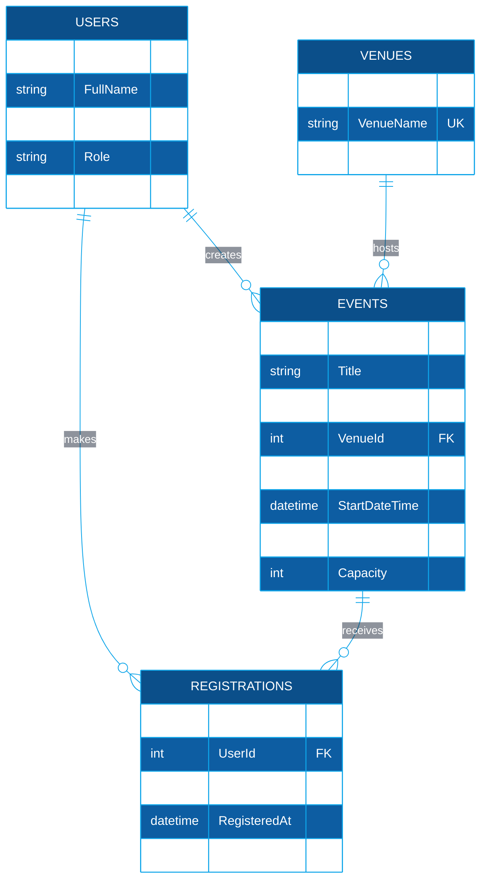

<div align="center">

# 🎓 Campus Event Hub
### Online Campus Event Management System


**Applied Generative AI for IT Solution Development**
*Group Hands-On Laboratory Examination • WPH Academy*

</div>

---

## 📑 Table of Contents
1. [Team Roster](#1-team-roster)
2. [Setup Instructions](#2-setup-instructions)
3. [Task 1: Requirements Analysis & Prompt Architecture](#task-1-requirements-analysis--prompt-architecture)
4. [Task 2: AI-Assisted Frontend](#task-2-ai-assisted-frontend)
5. [Task 3: Database Design](#task-3-database-design)
6. [Task 4: Testing, Security & Refactoring](#task-4-testing-security--refactoring)
7. [AI Disclosure Statement](#3-ai-disclosure-statement)
8. [Group Verification Log](#4-group-verification-log)

---

## 1. 👥 Team Roster

| Member | Name | Assigned Role | Responsibilities |
|:---:|---|---|---|
| Member 1 | **Kin Alejandro Ramos** | 🧠 Systems Architect & Prompt Lead | Task 1, Task 5, Task 4 (shared) |
| Member 2 | **Kenneth Nasser Nocon** | 🎨 Frontend Engineer | Task 2 |
| Member 3 | **Justine Dave Ocampo** | 🗄️ Database & Backend Engineer | Task 3, Task 4 (shared) |

> Group of 3: Member 1 and Member 3 split the responsibilities of Task 4.

---

## 2. ⚙️ Setup Instructions

1. **Clone the repository**
```bash
   git clone [repo-url]
   cd campus-event-management
```
2. **Frontend:** open `/frontend/index.html` in any browser (no build step).
3. **Database:** open SQL Server Management Studio, connect to your instance, and run `/database/schema.sql`.
4. **ERD:** view the Mermaid diagram in the Task 3 section below (GitHub renders it automatically).
5. **Tests:** `cd tests`, then `dotnet test` (requires .NET SDK, xUnit, Moq).
6. **Backend:** `/backend/RegistrationService.cs` takes the connection string via constructor injection.

### 📁 Project Structure
```
campus-event-management/
├── frontend/
│   ├── index.html
│   ├── styles.css
│   └── app.js
├── database/
│   └── schema.sql
├── backend/
│   ├── RegistrationService.cs
│   └── RegistrationValidator.cs
├── tests/
│   └── RegistrationValidatorTests.cs
└── SUBMISSION.md
```

---

## Task 1: Requirements Analysis & Prompt Architecture
**Lead:** Member 1 (Kin Alejandro Ramos) • **Framework:** Role–Context–Task–Constraints (RCTC)

### 📝 Exact Prompt
```
ROLE:
Act as a Lead Systems Architect with 10+ years of experience designing web systems for universities and mentoring student teams.

CONTEXT:
We are a team of 3 fourth-year BSIT students (beginner level in generative AI tools) building a working prototype of an Online Campus Event Management System within 3 hours. Students must view upcoming campus events and register for an event. Administrators must view the registered attendees of each event.

TASK:
Produce an overall system design containing:
1. Functional and non-functional requirements (short list)
2. High-level architecture and component responsibilities
3. Recommended tech stack (frontend, backend, database, testing)
4. Folder structure for a single GitHub repository
5. List of REST API endpoints
6. A 3-hour work breakdown for 3 members (Architect, Frontend, Database)

CONSTRAINTS:
- Do NOT use third-party state management libraries like Redux, MobX, or Zustand.
- Do NOT use microservices, Docker, Kubernetes, or cloud deployment.
- Do NOT use frontend frameworks; use vanilla HTML5, CSS3, and JavaScript only.
- Use C# (ASP.NET Core) for the backend and SQL Server for the database.
- Keep the answer under 500 words and use headings and bullet points only.
- Every recommendation must be realistic for a beginner team within 3 hours.
```

| RCTC Element | Where it appears |
|---|---|
| **Role / Persona** | Lead Systems Architect, 10+ years |
| **Context** | 3 BSIT students, 3-hour prototype, campus events |
| **Task** | 6 numbered deliverables |
| **Constraints** | 6 rules, including negative constraints (no Redux, no microservices, no frameworks) |

### 🤖 AI Output
```
## 1. Requirements
Functional: students view upcoming events; students register (one registration per event, seat limit enforced); admins view attendee list per event.
Non-functional: WCAG-aligned accessible UI, parameterized queries only, input validation (@univ.edu.ph emails), unit-tested validation logic.

## 2. Architecture (3-tier monolith)
- Presentation: static HTML/CSS/JS pages (catalog, registration form, admin attendee table).
- API layer: ASP.NET Core Minimal API exposing JSON endpoints.
- Service layer: RegistrationValidator (email + seat rules), RegistrationService (data access).
- Data layer: SQL Server (Users, Venues, Events, Registrations).
State is held in plain JS variables and fetched from the API; no external state library.

## 3. Tech Stack
- Frontend: HTML5, CSS3, vanilla JS (fetch API)
- Backend: C# ASP.NET Core
- Database: SQL Server (T-SQL)
- Testing: xUnit + Moq
- Version control: GitHub

## 4. Folder Structure
/frontend      index.html, styles.css, app.js
/backend       RegistrationService.cs, RegistrationValidator.cs
/database      schema.sql
/tests         RegistrationValidatorTests.cs
SUBMISSION.md

## 5. API Endpoints
- GET  /api/events                       list upcoming events with seats left
- POST /api/registrations                register {userId, eventId}
- GET  /api/admin/events/{id}/attendees  attendee list (admin only)

## 6. 3-Hour Plan
- M1 Architect (0:00-0:30): prompts, design; then docs/integration (2:45-3:00)
- M2 Frontend (0:30-1:15): catalog + form, semantic HTML, WCAG
- M3 Database (0:30-1:15): 3NF schema, ERD, DDL, indexes
- M1 + M3 (1:15-2:00): unit tests with mocks, fix SQL injection + resource leak
- All (2:00-2:45): integrate, test, fix, verification log
```

### ✅ Manual Grounding Evaluation
> The AI-generated architecture is realistic for a 3-hour prototype because it uses a simple three-tier monolith with only three API endpoints and four database tables, avoiding microservices and heavy frameworks. The time allocations match each member's role and run in parallel, which fits the 180-minute limit. One risk is that wiring the frontend to a live ASP.NET API plus SQL Server may take longer than planned for beginners, so the team decided to demo the UI with mock data and treat full API integration as optional. Overall the design is feasible after trimming scope to the core features (view events, register, view attendees).

---

## Task 2: AI-Assisted Frontend
**Lead:** Member 2 (Kenneth Nasser Nocon)

| Item | Details |
|---|---|
| 📂 Files | `/frontend/index.html`, `styles.css`, `app.js` |
| 🏷️ Semantic tags | `header`, `nav`, `main`, `section`, `article`, `footer` |
| ♿ WCAG (POUR) | Form labels, `aria-label` on inputs, 4.5:1 color contrast, image `alt` text, skip link, `aria-live` messages |
| ⚡ Features | Event catalog cards, registration form, email domain check (`@univ.edu.ph`), duplicate and capacity checks, admin attendee table |

---

## Task 3: Database Design
**Lead:** Member 3 (Justine Dave Ocampo)

### 🗺️ Entity-Relationship Diagram (Mermaid.js)


### 🧱 Schema Highlights
| Feature | Implementation |
|---|---|
| **3NF** | 4 tables: `Users`, `Venues`, `Events`, `Registrations` (no repeating groups or transitive dependencies) |
| **Foreign Keys** | `Events→Venues`, `Events→Users`, `Registrations→Users`, `Registrations→Events` |
| **CHECK constraints** | Role, Status, `Capacity > 0`, `EndDateTime > StartDateTime`, email format |
| **UNIQUE** | `Users.Email`, `Venues.VenueName`, `(UserId, EventId)` to prevent double registration |
| **Indexes** | Non-clustered index on every FK column |

📄 DDL script: [`/database/schema.sql`](database/schema.sql)

---

## Task 4: Testing, Security & Refactoring
**Lead:** Shared between Member 1 (Kin Alejandro Ramos) and Member 3 (Justine Dave Ocampo)

| Item | Details |
|---|---|
| 🧪 Unit tests | [`/tests/RegistrationValidatorTests.cs`](tests/RegistrationValidatorTests.cs) (xUnit + Moq mock objects) |
| 🔍 Diagnosis | SQL injection, unmanaged connection/command, hardcoded credentials, null reference |
| 🔐 Refactored code | [`/backend/RegistrationService.cs`](backend/RegistrationService.cs) (parameterized query + `using` blocks) |

---

## 3. 🤖 AI Disclosure Statement

**AI tools used:** Claude (Anthropic) for generating the system design, frontend code, SQL schema and ERD, unit tests, and the security refactor. *(Add any other tool you actually used, e.g. v0.)*

**Verification:** All outputs were reviewed by the member responsible. The frontend was opened and tested in a browser, the SQL script was executed on SQL Server, unit tests were run with `dotnet test`, and the refactored C# was reviewed against the original vulnerabilities.

---

## 4. 🛠️ Group Verification Log

| Task # | Identified AI Flaw / Limitation | Manual Correction Applied | Member Responsible |
|:---:|---|---|:---:|
| Task 1 | Design assumed a fully integrated API + DB, too ambitious for 3 hours | Reduced scope, frontend demos with mock data, API integration optional | Member 1 |
| Task 2 | Missing `aria-label` on inputs; low-contrast button color | Added `aria-label` to every input, changed colors to meet 4.5:1 contrast | Member 2 |
| Task 3 | No non-clustered indexes on foreign key columns | Added `CREATE NONCLUSTERED INDEX` for every FK column | Member 3 |
| Task 4 | Refactor queried `Registrations.Email`, but Email lives in `Users` (3NF); null result caused `NullReferenceException` | Added JOIN to `Users` and null-safe `?.ToString()`; kept `using` blocks for disposal | Member 1 & 3 |

---

<div align="center">

**Made with ☕ by Kin, Kenneth & Justine • DLSU-D BSIT**

</div>


