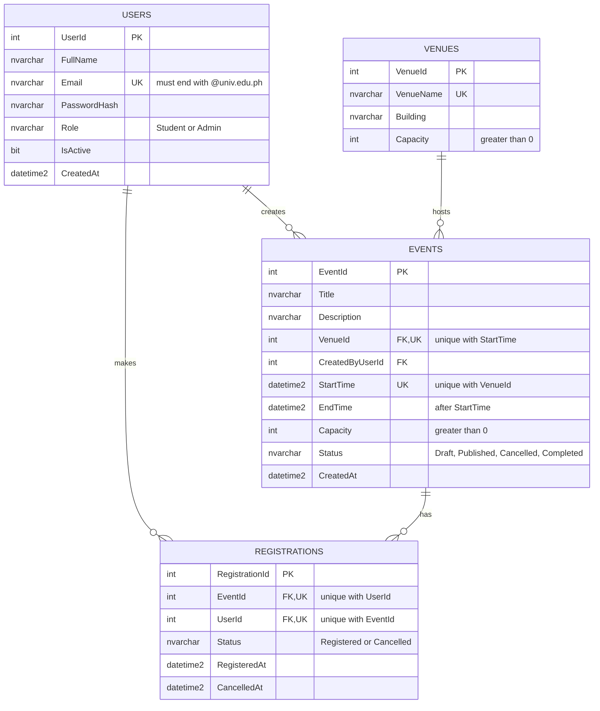

<div align="center">

# 🎓 Online Campus Event Management System

### Group Laboratory Examination Submission


**Students browse and register for campus events. Admins view the attendees.**

[📋 Roster](#1-team-roster) · [⚙️ Setup](#2-setup-instructions) · [🧠 Task 1](#task-1-requirements-analysis--prompt-architecture) · [🎨 Task 2](#task-2-ai-assisted-frontend) · [🗄️ Task 3](#task-3-database-design) · [🛡️ Task 4](#task-4-testing-security--refactoring) · [🤖 AI Disclosure](#3-ai-disclosure-statement) · [✅ Verification Log](#4-group-verification-log)

</div>

---

## 📌 Course Information

| | |
|---|---|
| **Course** | Applied Generative AI for IT Solution Development |
| **Section** | BIT42 |
| **Project** | Online Campus Event Management System |

---

## 1. Team Roster

| Member | Name | Assigned Role | Responsibilities |
|---|---|---|---|
| 👤 Member 1 | Kin Alejandro Ramos | Systems Architect & Prompt Lead | Task 1, Task 5 |
| 👤 Member 2 | Kenneth Nasser Nocon | Frontend Engineer | Task 2 |
| 👤 Member 3 | Justine Dave Ocampo | Database & Backend Engineer, QA & Security Engineer| Task 3 & Task 4 |

---

## 2. Setup Instructions

<details open>
<summary><b>🚀 Click to expand / collapse the steps</b></summary>

1. **Clone** the repository: `git clone [repo-url]`
2. **Frontend:** open `/frontend/index.html` in any browser (no build step).
3. **Database:** open SQL Server Management Studio, connect to your instance, and run `/database/schema.sql`.
4. **ERD:** view the Mermaid diagram below on GitHub (rendered automatically).
5. **Tests:** `cd tests`, then `dotnet test` (requires .NET SDK, xUnit, Moq).
6. **Backend:** `/backend/RegistrationService.cs` takes the connection string via constructor injection.

</details>

---

## Task 1: Requirements Analysis & Prompt Architecture

> 👤 **Owner:** Member 1 (Systems Architect & Prompt Lead)

<details>
<summary><b>💬 Exact Prompt</b> (click to expand)</summary>

```text
ROLE:
Act as a Lead Systems Architect with 10+ years of experience designing web systems for universities and mentoring student teams.

CONTEXT:
We are a team of 4 fourth-year BSIT students (beginner level in generative AI tools) building a working prototype of an Online Campus Event Management System within 3 hours. Students must view upcoming campus events and register for an event. Administrators must view the registered attendees of each event.

TASK:
Produce an overall system design containing:
1. Functional and non-functional requirements (short list)
2. High-level architecture and component responsibilities
3. Recommended tech stack (frontend, backend, database, testing)
4. Folder structure for a single GitHub repository
5. List of REST API endpoints
6. A 3-hour work breakdown for 4 members (Architect, Frontend, Database, QA/Security)

CONSTRAINTS:
- Do NOT use third-party state management libraries like Redux, MobX, or Zustand.
- Do NOT use microservices, Docker, Kubernetes, or cloud deployment.
- Do NOT use frontend frameworks; use vanilla HTML5, CSS3, and JavaScript only.
- Use C# (ASP.NET Core) for the backend and SQL Server for the database.
- Keep the answer under 500 words and use headings and bullet points only.
- Every recommendation must be realistic for a beginner team within 3 hours.
```

</details>

<details>
<summary><b>🤖 AI Output</b> (click to expand)</summary>

### Campus Event Management System: Design

#### 1. Requirements
**Functional**
- Students view upcoming events (title, date, venue, slots left)
- Students register for an event (one registration per student per event)
- Admin logs in and views attendees per event
- Registration blocked when the event is full

**Non-functional**
- Simple login (admin vs. student), passwords hashed
- Parameterized queries only (no SQL injection)
- Input validation on client and server
- Pages load in under 2 seconds on localhost
- Runs locally with one command

#### 2. Architecture
Three layers, one deployable app:
- **Frontend (vanilla JS):** static pages served from `wwwroot`; `fetch()` calls the API
- **API (ASP.NET Core Web API):** Controllers → Services → Repositories
- **Database (SQL Server LocalDB):** Students, Events, Registrations, Admins

**Responsibilities**
- Controllers: routing and HTTP responses
- Services: business rules (capacity, duplicate check)
- Repositories: SQL via EF Core
- Frontend `state.js`: plain JS object plus `sessionStorage` for the login token

#### 3. Tech Stack
- **Frontend:** HTML5, CSS3, vanilla JS (ES modules)
- **Backend:** ASP.NET Core 8 Web API, Entity Framework Core
- **Database:** SQL Server Express / LocalDB, SSMS
- **Auth:** Cookie auth or simple JWT, BCrypt hashing
- **Testing:** xUnit (services), Postman (API), manual test checklist

#### 4. Folder Structure
```
campus-events/
├── src/CampusEvents.Api/
│   ├── Controllers/
│   ├── Services/
│   ├── Repositories/
│   ├── Models/
│   ├── Data/            (DbContext, seed)
│   ├── wwwroot/
│   │   ├── index.html
│   │   ├── admin.html
│   │   ├── css/
│   │   └── js/          (api.js, state.js, events.js, admin.js)
│   └── Program.cs
├── database/            (schema.sql, seed.sql)
├── tests/CampusEvents.Tests/
├── docs/                (design.md, test-plan.md)
└── README.md
```

#### 5. REST Endpoints
- `POST /api/auth/login`
- `POST /api/auth/register-student`
- `GET /api/events` (upcoming only)
- `GET /api/events/{id}`
- `POST /api/events/{id}/register` (student)
- `GET /api/students/me/registrations`
- `GET /api/admin/events` (admin)
- `GET /api/admin/events/{id}/attendees` (admin)
- `POST /api/admin/events` (optional stretch)

#### 6. 3-Hour Work Breakdown

**Architect (Backend lead)**
- 0:00–0:30: Create solution, repo, controllers, DbContext
- 0:30–1:45: Services, endpoints, auth
- 1:45–2:30: Integrate with frontend, fix bugs
- 2:30–3:00: Final merge, README

**Frontend**
- 0:00–0:30: Page layouts and CSS
- 0:30–1:45: Event list, register button, login form (fetch calls)
- 1:45–2:30: Admin attendee table, error messages
- 2:30–3:00: Polish and responsive check

**Database**
- 0:00–0:30: Schema (unique constraint on StudentId + EventId)
- 0:30–1:00: Seed data (5 events, 10 students, 1 admin)
- 1:00–2:00: Verify EF mappings, test queries
- 2:00–3:00: Help backend, backup script

**QA/Security**
- 0:00–0:45: Test plan and Postman collection
- 0:45–1:45: Write xUnit tests (duplicate, full event)
- 1:45–2:30: Security checks (admin-only routes, SQL injection, XSS)
- 2:30–3:00: Regression run, demo script

**Rule:** Merge to `main` at the 1:45 and 2:30 marks only. Cut features before cutting tests.

</details>

<details>
<summary><b>🔍 Manual Grounding Evaluation</b> (click to expand)</summary>

The AI output satisfied the stated constraints (vanilla JS, no state libraries, ASP.NET Core + SQL Server, no Docker or cloud), but it assumed a fully integrated API, database, and auth flow, which is too ambitious for a beginner team in 3 hours. We reduced the scope so the frontend demos with mock data first and API integration stays optional. We also found an inconsistency: the design proposed Entity Framework Core for repositories, while our Task 4 security refactor uses parameterized ADO.NET (`Microsoft.Data.SqlClient`), so we standardized on parameterized ADO.NET. Finally, the AI left the auth choice open ("Cookie auth or simple JWT"), so we deferred authentication and treated the admin view as a prototype screen.

</details>

---

## Task 2: AI-Assisted Frontend

> 👤 **Owner:** Member 2 (Frontend Engineer)

- 📁 **Files:** `/frontend/index.html`, `styles.css`, `app.js`
- 🏷️ **Semantic tags used:** `header`, `nav`, `main`, `section`, `article`, `footer`
- ♿ **WCAG:** labels, `aria-label`, 4.5:1 contrast, alt text, skip link, `aria-live` messages
- ✅ **Rules enforced:** `@univ.edu.ph` email only, no duplicate registration, no over-capacity registration

---

## Task 3: Database Design

> 👤 **Owner:** Member 3 (Database & Backend Engineer)

### 🗺️ ERD (Mermaid)



📄 **DDL script:** `/database/schema.sql`

---

## Task 4: Testing, Security & Refactoring

> 👤 **Owner:** Member 4 (QA & Security Engineer)

- 🧪 **Tests:** `/tests/RegistrationValidatorTests.cs` (xUnit + Moq)
- 🔎 **Diagnosis:** SQL injection, unmanaged connection/command, hardcoded credentials, null reference
- 🔧 **Refactored code:** `/backend/RegistrationService.cs`

---

## 3. AI Disclosure Statement

AI tools used: **Claude (Anthropic)** for generating the system design, frontend code, SQL schema and ERD, unit tests, and the security refactor.

**Verification:** all outputs were reviewed by the member responsible. The frontend was opened and tested in a browser, the SQL script was executed on SQL Server, unit tests were run with `dotnet test`, and the refactored C# was reviewed against the original vulnerabilities.

---

## 4. Group Verification Log

| Task # | Identified AI Flaw / Limitation | Manual Correction Applied | Member Responsible |
|---|---|---|---|
| Task 1 | Design assumed a fully integrated API + DB, too ambitious for 3 hours | Reduced scope, frontend demos with mock data, API integration optional | Member 1 |
| Task 2 | Missing aria-label on inputs; low-contrast button color | Added aria-label to every input, changed colors to meet 4.5:1 contrast | Member 2 |
| Task 3 | No non-clustered indexes on foreign key columns | Added CREATE NONCLUSTERED INDEX for every FK column | Member 3 |
| Task 4 | Refactor queried `Registrations.Email`, but Email lives in `Users` (3NF); null result caused NullReferenceException | Added JOIN to Users and a null/DBNull-safe result check; kept `using` blocks for disposal | Member 4 |

---

<div align="center">

**Section BIT42** · Built with ☕, SQL Server, and a little help from AI

</div>
